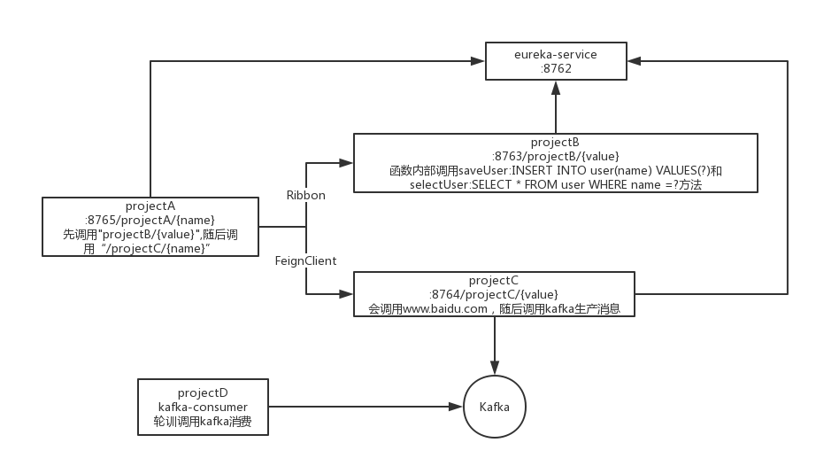

# 客户端服务如何接入DaoCloud MicroServices Platform产品的Demo

各个模块具体内容如下：

- apollo: 客户端接入配置中心的Demo
	- apollo-demo：通过@EnableApolloConfig("application")注解拉取配置中心的配置。

	- apollo demo 2:在Spring Boot初始bootstrap阶段注入配置。
	
- eureka：包括了eureka-server-demo和eureka-client-demo的样板工程，可参考eureka-client-demo将自己的应用注册到服务注册中心

- gateway:提供了几个简单的api接口：
	- test-web-app：可将该应用启动后，在DMP平台上面针对这些api做一些关于路由策略的操作，同时，可将该服务注册至eureka-server中。

- skwwalking：提供了java应用接入skywalking的几个例子：
	- dmp-skywalking-agent-examples-master：
		- dmp-skywalking-agent-trace-activation-demo：通过在代码中添加@Trace注解实现手动追踪。
		- dmp-skywalking-agent-trace-integration-log4j-demo：将skywalking中的TraceId与log4j等日志框架集成。
	- skywalking-live-demo：skywalking官方的演示例子：
		- eureka-service
		- projectA
		- projectB
		- projectC
		- projectD
		- 这几个服务之间的调用关系可查看：